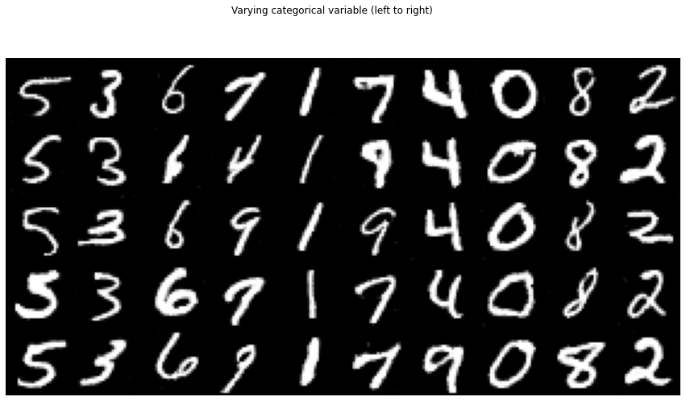
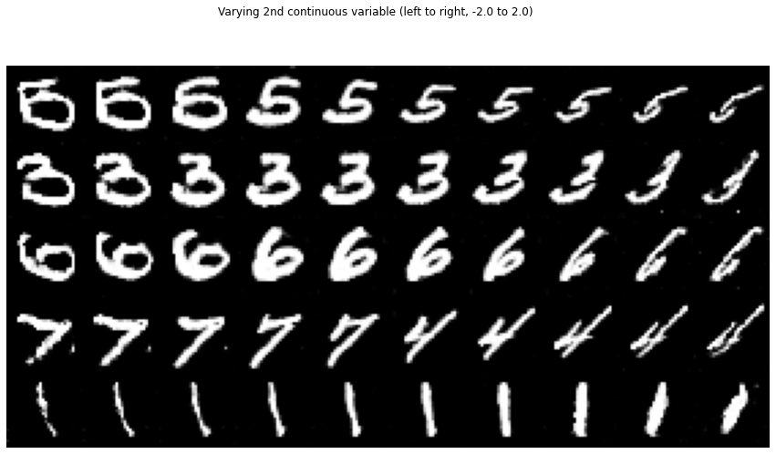
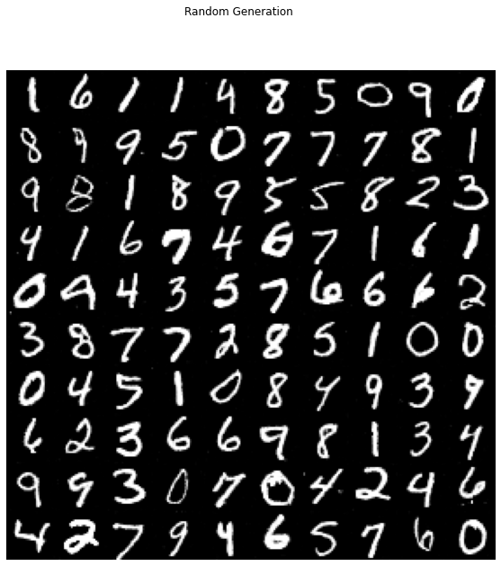

# InfoGAN_Tensorflow2.0
 Quick Tensorflow 2.0 implementation of [InfoGAN](https://arxiv.org/abs/1606.03657) trained on MNIST. Did this mainly to try out Tensorflow 2.0~  

## Training  

## Varying categorical latent code

## Varying 1st continuous latent code
  

## Varying 2nd continuous latent code
  

## Random Generation  

## References  
1. https://machinelearningmastery.com/how-to-develop-an-information-maximizing-generative-adversarial-network-infogan-in-keras/
1. https://github.com/SeonbeomKim/TensorFlow-InfoGAN    
1. https://github.com/eriklindernoren/PyTorch-GAN/blob/master/implementations/infogan/infogan.py
